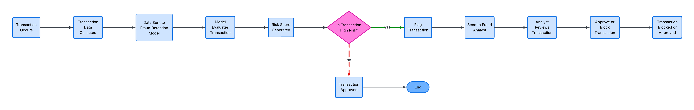

# Credit Card Fraud Detection — Business Analysis Case Study

## Overview
Business Analysis case study focused on defining requirements, mapping workflows, and delivering recommendations for a fraud detection problem in a highly imbalanced dataset (0.17% fraud rate).

---

## Key Contributions

- Defined fraud detection as a **business risk problem**, identifying challenges related to financial loss, false positives, and operational impact  
- Gathered and documented **functional and non-functional requirements** aligned with stakeholder needs  
- Developed **user stories, epics, and process flows** to model transaction workflows and system behavior  
- Evaluated solution approaches and identified **trade-offs between performance, operational efficiency, and real-time feasibility**  
- Delivered **business-focused recommendations** to improve fraud detection while minimizing operational disruption  

---

## Deliverables

- 📄 [Case Study (PDF)](Credit_Card_Fraud_Detection__Business_Analysis_Case_Study.pdf)  
- 🔄 [Process Flow Diagram](Process_Flow.png)  
- ⚙️ Jira Workflow: [Sprint Structure](Jira-Workflow-01.png) | [User Story Structure](Jira-Story-Example.png) | [Completed Backlog Items](Jira-Workflow-02.png)  

---

## Process Flow

---

## Agile Approach (Jira)

Work was structured into sprints and tracked using Agile workflow stages:

**Workflow Stages:**  
To Do → In Progress → Review → Done  

**Sprint Breakdown:**  
- Sprint 1: Requirements  
- Sprint 2: Process Flow  
- Sprint 3: Analysis  
- Sprint 4: Recommendations  

---

## Skills Demonstrated

- Requirements Gathering & Documentation  
- Stakeholder Analysis  
- Process Mapping & Workflow Design  
- Agile (Scrum) & Jira  
- Decision Support & Trade-Off Analysis  

---

## Tools Used

- Jira  
- Notion  
- Lucidchart / Microsoft Visio  

---

## Summary

This case study demonstrates the ability to structure business problems, define requirements, and translate analysis into actionable recommendations within an Agile environment.
